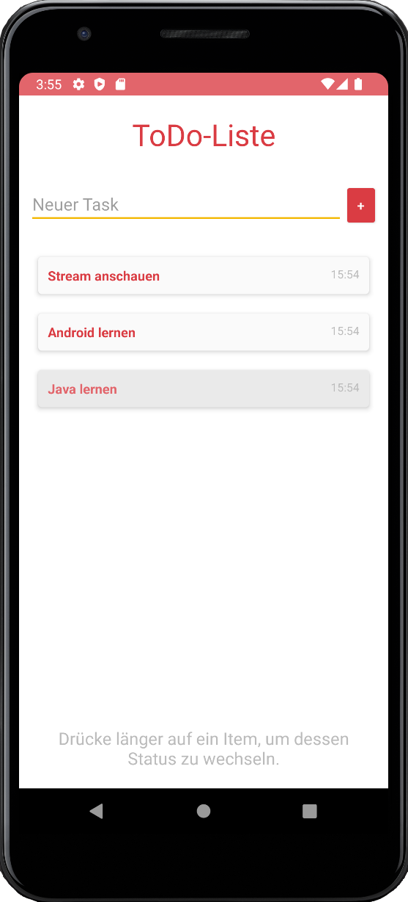

# U04 | Eine einfache ToDo-Liste

## Aufgabe

In dieser Aufgabe implementieren Sie ein ToDo-Liste. NutzerInnen können neue Aufgaben zur Liste hinzufügen. Die Einträge der Liste werden stets so sortiert, dass neue Aufgaben an oberster Stelle angezeigt werden. Durch einen langen Klick auf einzelne Einträge können Aufgaben als *erledigt* markiert werden. Solche Aufgaben werden dann am Ende der Liste und mit einer angepassten Darstellung angezeigt. **Zur Umsetzung der Aufgabe verwenden Sie einen angepassten `ArrayAdapter` und ein selbst-erstelltes Layout für die Listeneinträge.**

**Achtung:** Spätestens hier beginnen die Übungsaufgaben komplizierter zu werden. Nehmen Sie sich ausreichend Zeit und erarbeiten Sie Schritt für Schritt Ihre eigene Lösung. Versuchen Sie die Zusammenhänge und Hintergründe zu verstehen. An schwierigen Stellen bieten wir Ihnen im Übungsblatt zwei unterschiedlich komplexe Möglichkeiten an. Wenn Sie sich für den "einfacheren" Weg entscheiden, können Sie später versuchen den alternativen Vorschlag in Ihre funktionierende Lösung integrieren.

### Vorgaben

Im Startercode finden Sie ein rudimentäres Android-Projekt. Neben einem einfachen Layout (`activity_main.xml`) für die zentrale *Activity* der App ist dort auch eine `Task`-Klasse vorgegeben. Nutzen Sie diese zur logischen Repräsentation von Aufgaben innerhalb Ihrer Anwendung. Die Klasse verfügt  über Methoden zur (tiefen) Kopie einer Aufgabe und implementiert das `Comparable`-*Interface*, dass eine Sortierung mehrere Aufgaben nach den oben genannten Kriterien erlaubt. Eine sehr einfache Möglicheit zur automatischen Sortierung von Objekten, deren Klassen `Comparable` implementieren, ist die Verwendung der [`Collections.sort`-Methode](https://docs.oracle.com/javase/8/docs/api/java/util/Collections.html#sort-java.util.List-), die eine als Parameter übergebene List *in-place* sortiert und dabei die jeweilige Implementierung der `comparteTo`-Methode verwendet. **Sie müssen die `Task`-Klasse zur Lösung der Aufgabe nicht verändern.**


## Vorgehen

Versuchen Sie bei der Lösung der Aufgabe bewusst eine Trennung zwischen der internen Repräsentation der *Tasks* und deren Darstellung im *User Interface* zu erreichen. Behalten Sie dabei diesen Grundsatz im Kopf: "Ihre App verwaltet intern eine Liste von Aufgaben. Über das *User Interface* können NutzerInnen Parameter für neue Aufgaben eingegeben und den Status existierender Aufgaben ändern. Diese Aktionen haben zuerst Auswirkungen auf die interne Liste. Der ListView zeigt stets den aktuellen Stand dieser internen Liste an, das *User Interface* verwaltet diese Liste aber nicht selbstständig."

1. Laden Sie sich das Starterpaket herunter und verschaffen Sie sich einen Überblick über den vorgegebenen Code. Starten Sie das Projekt im Emulator, um sicherzustellen, dass Sie mit einer funktionierenden Version der App in die Implementierung starten.

2. **Interne Verwaltung der Aufgaben-Liste**: In einem ersten Schritt kümmern Sie sich darum, dass Ihre App über eine Möglichkeit verfügt, die Liste der relevanten Tasks intern zu verwalten. Für diesen Teil der Aufgabe gibt es mindestens zwei mögliche Ansätze, die das Konzept der klaren Trennung zwischen UI und Datengrundlagen unterschiedlich stark umsetzen.
   * **Im einfachen Fall** verfügt die zentrale Activity der App über eine ArrayList, in der beliebig viele Aufgaben (`Task`-Objekte) gespeichert werden können. Ergänzen Sie zwei nicht-öffentliche Methoden über die neue Aufgaben (auf Basis eines übergebenen Beschreibungstexts) hinzugefügt und der Status (*offen* bzw. *erledigt*) bestehender Aufgaben angepasst werden können. 
   * **Alternativ** können Sie für die interne Verwaltung der Aufgabenliste auch eine vollständig separate Komponente verwenden. Erstellen Sie dazu eine Klasse `TaskManager`, in der die interne Verwaltung der Aufgaben implementiert wird. Diese Klasse soll: a) eine Liste von Task-Objekten verwalten, b) eine öffentliche Methode zum Hinzufügen neuer Aufgaben auf Basis einer Aufgabenbeschreibung (`description`) anbieten, c) eine öffentliche Methode zum Umschalten des Status (*offen* zu *erledigt*) einer Aufgabe innerhalb der Liste anbieten und d) über eine öffentliche Methode eine (sortierte) Kopie der aktuell gespeicherten Aufgaben nach Außen geben. **Testen Sie die Funktion der Klasse, in der Sie diese in der `onCreate`-Methode Ihrer Activity initialisieren, programmatisch mit Inhalt befüllen und die Elemente der Listen-Kopie per Log-Befehl ausgeben.**

3. Erstellen Sie ein eigenes Layout für die Listeneinträge. Erzeugen Sie dazu unter `layout` eine neue XML-Datei. Hier definieren Sie die Elemente, die später Teil eines einzelnen Eintrags des `ListView`  sein sollen. Im einfachsten Fall sorgen Sie dafür, dass über zwei `TextView`, die z.B. Kinder eines *Linear-Layouts* sein können, Platz für die Anzeige der Beschreibung und des Erstellungsdatums der einzelnen Aufgaben ist. Vergessen Sie nicht, alle Elemente, die später im Quellcode mit Inhalten gefüllt werden sollen, mit eindeutigen IDs auszustatten.

4. Erstellen Sie einen angepassten Adapter, der das vorhandene `ListView` (siehe `activity_main.xml`) mit den Einträgen der vorbereiteten ArrayList oder den vom `TaskManger`  verwalteten Inhalten verbindet und dabei das eben erstellte Layout für die Darstellung der einzelnen Aufgaben innerhalb des `ListView` verwendet. Ihr Adapter erbt von `ArrayAdapter` (spezifizieren Sie den Typ der Objekte, die dieser Adapter verwendet über `extends ArrayAdapter<Task>`). Innerhalb des Adapters werden die aktuell im UI darzustellenden Aufgaben in einer passenden `ArrayList` verwaltet. Implementieren Sie eine öffentliche Methode, die es Ihnen erlaubt, diese Liste durch ein neues Set an Aufgaben zu ersetzen. Überschreiben Sie anschließende die beiden geerbten Methoden `getCount` (gibt die aktuelle Anzahl der Aufgaben in der `ArrayList` zurück) und `getView` (hier werden auf Anfrage des verknüpften `ListView` die UI-Elemente zur Darstellung der einzelnen Listenelemente erzeugt bzw. zurückgeben). In der `getView`-Methode erstellen Sie einen passenden View, in dem Sie das vorbereitet Layout (siehe Punkt 3) über Angabe des Dateinamen *inflaten* und anschließend die dortigen `TextView` mit den Werte eines der Task-Objekte befüllen. Über den Parameter `position` der `getView`-Methode teilt Ihnen das aufrufende `ListView` mit, welches Element (an welcher Position) ein `View` angefordert wird.

5. Referenzieren Sie in der *Activity* das `ListView` und erstellen Sie den Adapter. Verbinden Sie beide Elemente und testen Sie Ihre Anwendung: 1) Fügen Sie neue Aufgaben zur ArrayList (oder zum Manager hinzu), 2) übergeben Sie dem Adapter die so veränderten Aufgabenliste und 3) informieren Sie das angeschlossen `ListView` über die Änderungen (Methode `notifyDataSetChanged` des Adapters).

6. Verbinden Sie jetzt die losen Enden Ihre Anwendung: Nutzen Sie die vorgegebenen UI-Elemente um neue Aufgaben durch die NutzerInnen erstellen zu lassen. Behalten Sie dabei die bereits erprobte Reihenfolge ein: Die durch die NutzerInnen eingegebene Beschreibung wird an den `TaskManger` übergeben, der eine neue Aufgabe erstellt. Der Adapter erhält dann die veränderten Liste und informiert im Anschluss das `ListView`. Auf dem `ListView` registrieren Sie eine Listener, der es Ihnen erlaubt lange Klicks auf den Einträgen abzufangen (`setOnItemLongClickListener`). Als Reaktion auf diese *Events* ändern Sie den Status des angeklickten Elements und sorgen auch hier wieder dafür, das am Ende, über den Adapter, das `ListView` die Veränderungen des App-Zustands korrekt anzeigt.

### Inflaten des Layouts

Um aus der vorbereiteten XML-Datei im Code ein konkretes View-Objekt zu erzeugen, können Sie sich an diesem Code orientieren. Als `resource` wird dabei die ID des jeweiligen Layouts (XML-Datei) übergeben.

```
private View inflateViewTask(int resource, ViewGroup parent) {
  LayoutInflater inflater = (LayoutInflater) getContext().getSystemService(Context.LAYOUT_INFLATER_SERVICE);
  return inflater.inflate(resource, parent, false);
}
```

## Mögliche Erweiterungen


### CardViews und Darstellung des Status einzelner Aufgaben

Aus der Vorlesung kennen Sie bereits das [Material Design](https://material.io/develop/android) als zentrale Designsprache der Android-Plattform. Für die Darstellung von Listen heterogener Daten, wie in unserem Beispiel die ToDo-Einträge, werden [CardView](https://developer.android.com/jetpack/androidx/releases/cardview) empfohlen, die wir auch in unserem Lösungsvorschlag als Grundlage für die einzelnen Einträge der Liste verwenden. Dafür sind einige Änderungen am Code erforderlich, die auf der verlinkten Seite erklärt werden. Zusätzlich haben wir zwei verschieden Varianten des Layouts für die einzelnen Listeneinträge implementiert, um offene und erledigte Tasks auch optisch voneinander unterscheiden zu können. Lassen Sie bei der Gestaltung der Liste Ihrer Kreativität freien Lauf!

### Umgang mit der internen Aufgabenliste

Ein wesentliches Merkmale guter Software ist der sicherer Umgang mit der jeweiligen Datengrundlage. In unserer bisherigen Lösung missachten wir diesen Grundsatz, in dem wir dem UI-Adapter direkt Zugriff auf die interne Aufgabenliste ermöglichen. Dadurch nehmen wir in Kauf, dass die Inhalte dieser Liste nicht mehr nur innerhalb der Activity (bzw. dem `TaskManager`) manipuliert werden können. Der Adapter kann auf die referenzierten Task-Objekte der Liste zugreifen und direkt deren Zustand ändern. Eine einfache Lösung ist die Verwendung tiefer (*deep*) Kopien der Aufgabenliste. Statt dem Original erhält der Adapter nur eine Kopie der aktuellen Aufgabenliste. Jedes mal, wenn sich die interne Aufgabenliste ändert, übergeben wir eine neue Kopie an den Adapter. Sie können diese Mechanismus leicht in die bereits implementierte Lösung integrieren, in dem Sie an geeigneter Stelle die `copy`-Funktion der `Task`-Klasse verwenden.

## Screenshots der Anwendung

