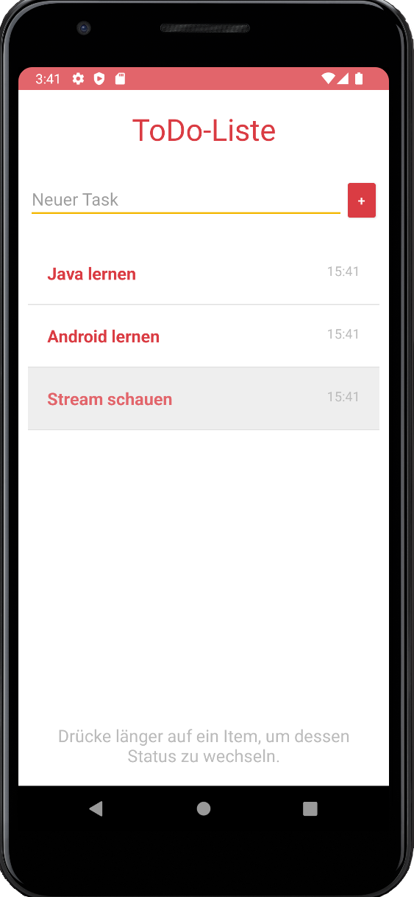

# U04 | Eine einfache ToDo-Liste

## Aufgabenstellung

In dieser Aufgabe implementieren Sie ein ToDo-Liste. NutzerInnen können neue Aufgaben zur Liste hinzufügen. Die neuen Listenelemente werden ganz oben in der Liste eingefügt. Durch einen langen Klick auf einzelne Einträge können Aufgaben als *erledigt* markiert werden. Solche Aufgaben werden dann am Ende der Liste und mit einer veränderten Darstellung angezeigt. **Zur Umsetzung der Aufgabe verwenden Sie einen `ArrayAdapter` und ein selbst-erstelltes Layout für die Listeneinträge.**

## Hinweise

**Achtung:** Spätestens hier beginnen die Übungsaufgaben komplizierter zu werden. Nehmen Sie sich ausreichend Zeit und erarbeiten Sie Schritt für Schritt Ihre eigene Lösung.** Versuchen Sie die Zusammenhänge und Hintergründe zu verstehen. An schwierigen Stellen bieten wir Ihnen im Übungsblatt zwei unterschiedlich komplexe Möglichkeiten an. Wenn Sie sich für den "einfacheren" Weg entscheiden, können Sie später gerne den alternativen Vorschlag in Ihre funktionierende Lösung integrieren.

### Inflaten des Layouts

Um aus der von Ihnen vorbereiteten XML-Datei im Code ein konkretes View-Objekt zu erzeugen, können Sie sich an diesem Code orientieren. Als `resource` wird dabei die ID des jeweiligen Layouts (XML-Datei) übergeben.

```java
private View inflateViewTask(int resource, ViewGroup parent) {
  LayoutInflater inflater = (LayoutInflater) getContext().getSystemService(Context.LAYOUT_INFLATER_SERVICE);
  return inflater.inflate(resource, parent, false);
}
```

## Vorgehen

### Starterpaket

Laden Sie sich das Starterpaket herunter, das Sie links auf dieser Seite finden. Entpacken Sie den Projektordner und öffnen Sie das Projekt in *Android Studio*. Beim ersten Start synchronisiert *Android Studio* die Projektinhalte und installier ggf. noch fehlende Abhängigkeiten. Im Startercode finden Sie ein rudimentäres Android-Projekt. Neben einem einfachen Layout (`activity_main.xml`) für die zentrale *Activity* der App ist dort auch eine `Task`-Klasse vorgegeben. Nutzen Sie letztere zur logischen Repräsentation von Aufgaben innerhalb Ihrer Anwendung. Die Klasse verfügt  über Methoden zur (tiefen) Kopie einer Aufgabe und implementiert das `Comparable`-*Interface*, dass eine Sortierung mehrerer Aufgaben nach den oben genannten Kriterien erlaubt. Eine sehr einfache Möglicheit zur automatischen Sortierung von Objekten, deren Klassen *[Comparable](https://docs.oracle.com/javase/8/docs/api/java/lang/Comparable.html)* implementieren, ist die Verwendung der [`Collections.sort`-Methode](https://docs.oracle.com/javase/8/docs/api/java/util/Collections.html#sort-java.util.List-), die eine als Parameter übergebene List *in-place* sortiert und dabei die jeweilige Implementierung der `comparteTo`-Methode verwendet. **Sie müssen/sollten die `Task`-Klasse zur Lösung der Aufgabe nicht verändern.**

Versuchen Sie bei der Lösung der Aufgabe bewusst eine strikte Trennung zwischen der internen Repräsentation der *Tasks* und deren Darstellung im *User Interface* zu erreichen. Behalten Sie dabei diesen Grundsatz im Kopf: "Ihre App verwaltet intern eine Liste von Aufgaben. Über das *User Interface* können NutzerInnen Parameter für neue Aufgaben eingegeben und den Status existierender Aufgaben ändern. Diese Aktionen haben zuerst Auswirkungen auf die interne Liste. Der ListView zeigt stets den aktuellen Stand dieser internen Liste an, das *User Interface* verwaltet diese Liste aber nicht selbstständig."

**Zwischenziell**: Versuchen Sie das Starterpaket auf dem Emulator (oder Ihrem physischen Smartphone) zu starten.

### Schritt 1: Interne Aufgaben-Liste

Im ersten Schritt kümmern Sie sich darum, dass Ihre App über eine Möglichkeit verfügt, die Liste der relevanten Tasks intern zu verwalten. Für diesen Teil der Aufgabe gibt es mindestens zwei mögliche Ansätze, die das Konzept der klaren Trennung zwischen UI und Datengrundlagen unterschiedlich stark umsetzen.
   * **Im einfachen Fall** verfügt die zentrale Activity der App über eine ArrayList, in der beliebig viele Aufgaben (`Task`-Objekte) gespeichert werden können. Ergänzen Sie zwei nicht-öffentliche Methoden über die neue Aufgaben (auf Basis eines übergebenen Beschreibungstexts) hinzugefügt und der Status (*offen* bzw. *erledigt*) bestehender Aufgaben angepasst werden können. 
   * **Alternativ** können Sie für die interne Verwaltung der Aufgabenliste auch eine vollständig separate Komponente verwenden. Erstellen Sie dazu eine Klasse `TaskManager`, in der die interne Verwaltung der Aufgaben implementiert wird. Diese Klasse soll: a) eine Liste von Task-Objekten verwalten, b) eine öffentliche Methode zum Hinzufügen neuer Aufgaben auf Basis einer Aufgabenbeschreibung (`description`) anbieten, c) eine öffentliche Methode zum Umschalten des Status (*offen* zu *erledigt*) einer Aufgabe innerhalb der Liste anbieten und d) über eine öffentliche Methode eine (sortierte) Kopie der aktuell gespeicherten Aufgaben nach Außen geben. **Testen Sie die Funktion der Klasse, in der Sie diese in der `onCreate`-Methode Ihrer Activity initialisieren, programmatisch mit Inhalt befüllen und die Elemente der Listen-Kopie per Log-Befehl ausgeben.**

  **Zwischenziel:** Die App hat eine Möglichkeit eine Liste von Task-Objekten zu verwalten. Es existieren Methoden zum hinzufügen von Tasks und zum Verändern des Status der Tasks. Die Anwendung lässt sich weiterhin fehlerfrei starten.

### Schritt 2: Ein Layout für Listeneinträge

Erstellen Sie ein eigenes Layout für die Listeneinträge. Erzeugen Sie dazu unter `layout` im `res`-Ordner eine neue XML-Datei. Hier definieren Sie die Elemente, die später Teil eines einzelnen Eintrags des `ListView`  sein sollen. Im einfachsten Fall sorgen Sie dafür, dass über zwei `TextView`, die z.B. Kinder eines *Linear-Layouts* sein können, Platz für die Anzeige der Beschreibung und des Erstellungsdatums der einzelnen Aufgaben ist. Vergessen Sie nicht, alle Elemente, die später im Quellcode mit Inhalten gefüllt werden sollen, mit eindeutigen IDs auszustatten.

**Zwischenziel:** Es gibt ein XML-Layout, das beschreibt wie ein Listeneintrag aussieht.

### Schritt 3: Adapter für Liste

Erstellen Sie eine Klasse für einen angepassten Adapter, der das vorhandene `ListView` (siehe `activity_main.xml`) mit den Einträgen der vorbereiteten ArrayList oder den vom `TaskManger`  verwalteten Inhalten verbindet und dabei das eben erstellte Layout für die Darstellung der einzelnen Aufgaben innerhalb des `ListView` verwendet. Ihr Adapter erbt von `ArrayAdapter` (spezifizieren Sie den Typ der Objekte, die dieser Adapter verwendet über `extends ArrayAdapter<Task>`).

Innerhalb des Adapters werden die aktuell im UI darzustellenden Aufgaben in einer passenden `ArrayList` verwaltet.

Implementieren Sie eine öffentliche Methode, die es Ihnen erlaubt, diese Liste durch ein neues Set an Aufgaben zu ersetzen. Überschreiben Sie anschließende die beiden geerbten Methoden `getCount` (gibt die aktuelle Anzahl der Aufgaben in der `ArrayList` zurück) und `getView` (hier werden auf Anfrage des verknüpften `ListView` die UI-Elemente zur Darstellung der einzelnen Listenelemente erzeugt bzw. zurückgeben). In der `getView`-Methode erstellen Sie einen passenden View, in dem Sie das vorbereitet Layout (siehe Punkt 3) über Angabe des Dateinamen *inflaten* (siehe oben) und anschließend die dortigen `TextView` mit den Werte eines der Task-Objekte befüllen. Über den Parameter `position` der `getView`-Methode teilt Ihnen das aufrufende `ListView` mit, welches Element (an welcher Position) ein `View` angefordert wird.

**Zwischenziel:** Es gibt eine Klasse für einen Adapter, der die interne Liste von Aufgaben mit dem UI-ListView verbindet. Dieser hat überschriebene Methoden `getCount` und `getView` und zusätzlich eine öffentliche Methode, um die Liste der Aufgaben im Adapter zu ersetzen. Die Anwendung lässt sich immer noch fehlerfrei starten.

### Schritt 4: Liste an Adapter anschließen

Referenzieren Sie in der *Activity* das `ListView`-UI-Element und erzeugen Sie eine Instanz des Adapters. Verbinden Sie beide Elemente und testen Sie Ihre Anwendung:
  1. Fügen Sie neue Aufgaben zur ArrayList oder zum Manager hinzu
  2. Übergeben Sie dem Adapter die so veränderten Aufgabenliste
  3. Informieren Sie das angeschlossene `ListView`-Element über die Änderungen (Methode `notifyDataSetChanged` des Adapters, welche von der Superklasse geerbt wird).

**Zwischenziel:** Das ListView zeigt nun beim Start der App den Inhalt an, der der veränderten Aufgabenliste entspricht. Das ListView ist nicht mehr leer.

### Schritt 5: Hinzufügen von Aufgaben

Verbinden Sie jetzt die losen Enden Ihre Anwendung: Nutzen Sie die vorgegebenen UI-Elemente (EditText und Button), um neue Aufgaben durch die NutzerInnen erstellen zu lassen. Behalten Sie dabei die bereits erprobte Reihenfolge ein:
  1. Die durch die NutzerInnen eingegebene Beschreibung wird an den `TaskManger` übergeben, der eine neue Aufgabe erstellt
  2. Der Adapter erhält dann die veränderten Liste und informiert im Anschluss das `ListView` (wie in Schritt 4)
  3. Das ListView zeigt nun die neuen Elemente an

**Zwischenziel:** Durch Eingabe eines Texts und Drücken des Buttons kann ein neues Element zum `ListView` hinzugefügt werden. Dieses wird ganz oben in der Liste angezeigt.

### Schritt 6:
Auf dem `ListView` registrieren Sie nun einen Listener, der es Ihnen erlaubt lange Klicks auf den Einträgen abzufangen (`setOnItemLongClickListener`). Als Reaktion auf diese *Events* ändern Sie den Status des angeklickten Elements. Sorgen auch hier wieder dafür über den Adapter, das `ListView` die Veränderungen des App-Zustands korrekt anzeigt. Dazu muss bei Tasks deren State nicht mehr `OPEN` sondern `CLOSED` ist (inneres Enum `TaskState` in `Task`-Klasse) ein anderes Layout *infaltet* werden. Darüber hinaus sollten diese Tasks an das Ende der Liste (ArrayList oder Manager) sortiert werden, so dass Sie auch ListView am Ende angezeigt werden, dazu kann die `sort`-Methode der ArrayList verwendet werden (da die Tasks das `Comparable`-Interface implementieren).

**Zwischenziel:** Tasks lassen sich nun durch einen langen Klick als abgeschlossen markieren. Dadurch ändert sich ihr Layout und ihre Position in der Liste.

## Mögliche Erweiterungen


### CardViews und Darstellung des Status einzelner Aufgaben

Aus der Vorlesung kennen Sie bereits das [Material Design](https://material.io/develop/android) als zentrale Designsprache der Android-Plattform. Für die Darstellung von Listen heterogener Daten, wie in unserem Beispiel die ToDo-Einträge, werden [CardViews](https://developer.android.com/jetpack/androidx/releases/cardview) empfohlen, die wir auch in unserem Lösungsvorschlag als Grundlage für die einzelnen Einträge der Liste verwenden. Dafür sind einige Änderungen am Code erforderlich, die auf der verlinkten Seite erklärt werden. Zusätzlich haben wir zwei verschieden Varianten des Layouts für die einzelnen Listeneinträge implementiert, um offene und erledigte Tasks auch optisch voneinander unterscheiden zu können. Lassen Sie bei der Gestaltung der Liste Ihrer Kreativität freien Lauf!

### Umgang mit der internen Aufgabenliste

Ein wesentliches Merkmale guter Software ist der sicherer Umgang mit der jeweiligen Datengrundlage. In unserer bisherigen Lösung missachten wir diesen Grundsatz, in dem wir dem UI-Adapter direkt Zugriff auf die interne Aufgabenliste ermöglichen. Dadurch nehmen wir in Kauf, dass die Inhalte dieser Liste nicht mehr nur innerhalb der Activity (bzw. dem `TaskManager`) manipuliert werden können. Der Adapter kann auf die referenzierten Task-Objekte der Liste zugreifen und direkt deren Zustand ändern. Eine einfache Lösung ist die Verwendung tiefer (*deep*) Kopien der Aufgabenliste. Statt dem Original erhält der Adapter nur eine Kopie der aktuellen Aufgabenliste. Jedes mal, wenn sich die interne Aufgabenliste ändert, übergeben wir eine neue Kopie an den Adapter. Sie können diese Mechanismus leicht in die bereits implementierte Lösung integrieren, in dem Sie an geeigneter Stelle die `copy`-Funktion der `Task`-Klasse verwenden.

### RecyclerView

*ListViews* und *ArrayAdapter* sind valide Möglichkeiten, um strukturierte Daten in Android-Apps anzuzeigen. Mittelfristig sollten für die meisten Anwendungsfälle aber [RecylerViews](https://developer.android.com/guide/topics/ui/layout/recyclerview) in Zusammenarbeit mit den entsprechenden [Adaptern](https://developer.android.com/reference/androidx/recyclerview/widget/RecyclerView.Adapter) verwendet werden. Auch für diese App können die entsprechenden Stellen mit relativ wenig Aufwand durch diese Recycler-Komponenten ersetzt werden.


## Screenshots der Anwendung

[//]: <> (austauschen!)

|  Einfache Lösung   |   Lösung mit CardViews für die Listenelemente    |
|:------:|:-------:|
|    |   |
